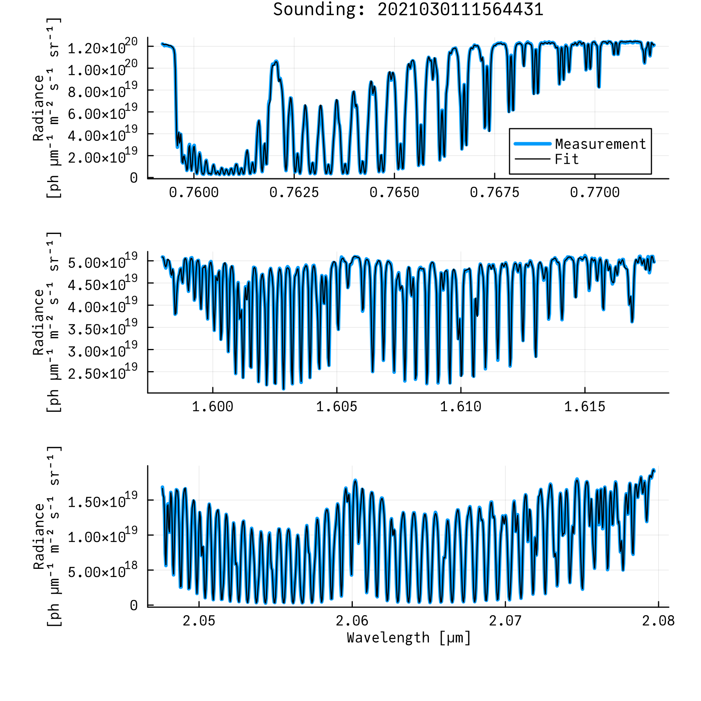

# ACOS Goddard

This is an independent implementation of NASA's ACOS retrieval algorithm, making use of the [RetrievalToolbox.jl library](https://github.com/US-GHG-Center/RetrievalToolbox.jl). More on the ACOS algorithm can be found in following publications:

* version 8: [https://doi.org/10.5194/amt-11-6539-2018](https://doi.org/10.5194/amt-11-6539-2018)
* version 9: [https://doi.org/10.5194/essd-14-325-2022](https://doi.org/10.5194/essd-14-325-2022)
* version 10: [https://doi.org/10.5194/amt-16-3173-2023](https://doi.org/10.5194/amt-16-3173-2023)

Please visit the [documentation](https://retrievaltoolbox.github.io/ACOS-Goddard/) on installation, usage and known issues.

Below is the fit that can be produced with the example data within the repository, as well as the additional files that can be freely downloaded via the instructions found on the install guide.

ACOS-Goddard was written at the University of Maryland and NASA Goddard Space Flight Center.